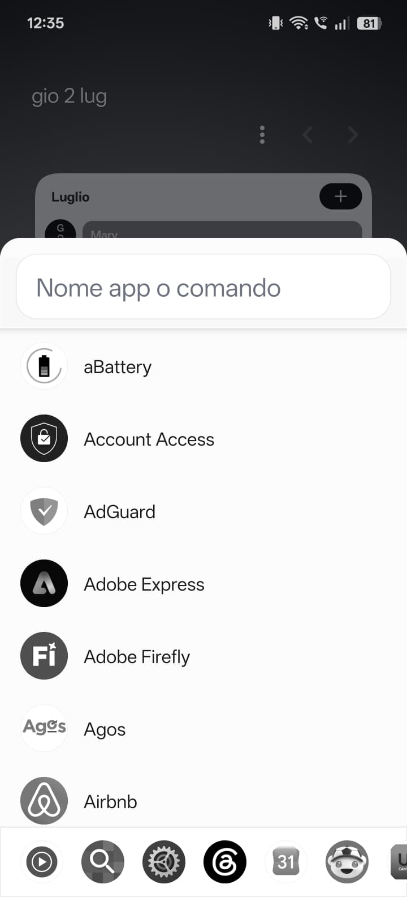

# SideSearch

**Universal Android search for apps, commands, notifications, weather, and media controls.**

SideSearch is a native Android app that lets you search and launch apps, run quick commands, check notifications, control media playback, and access useful information without returning to the Home screen.

Set it as your default Android assistant and open it from the system gesture or shortcut supported by your device.

## Get SideSearch

SideSearch is distributed free of charge. Download the official signed APK from GitHub Releases:

### [Download SideSearch](https://github.com/noisystyle/SideSearch/releases/latest)

No payment is required to download or use the app. The release includes the signed Android APK and its SHA-256 checksum.

> This is the official public information and release repository. It intentionally contains no application source code. SideSearch is proprietary software and is not open source.

## Preview

  

## Features

- Fast app search with exact, prefix, acronym, fuzzy, and typo-tolerant matching.
- Recent apps and contextual Android app shortcuts.
- Android assistant integration for access from the system gesture or button.
- Optional persistent edge handles for opening search or notifications over other apps.
- Horizontally scrollable quick controls for connectivity, rotation, brightness, volume, ringer mode, wallet, and system settings.
- Adaptive Home widget with search and synchronized recent apps.
- Interactive notifications grouped under their source apps.
- Rich media cards with artwork and available previous, play/pause, next, like, and close controls.
- Weather cards with current conditions, hourly data, and a five-day forecast.
- Contact commands for calls, SMS, email, WhatsApp, Telegram, and Signal.
- Natural-language calendar event drafts in English and Italian.
- Quick commands for Google, Maps, YouTube, ChatGPT, Gemini, and messaging apps.
- Automatic recognition of email addresses, URLs, phone numbers, and calculations.
- Light, dark, and system themes with customizable icon shapes and monochrome mode.
- Adaptive layouts for phones, landscape displays, tablets, and foldables.

Weather data by [Open-Meteo.com](https://open-meteo.com/).

## Example commands

| Action | Example |
| --- | --- |
| Weather | `we Naples` or `meteo Rome` |
| Google | `g android split screen` |
| Maps | `maps pizza nearby` |
| YouTube | `yt phone review` |
| ChatGPT | `ch summarize this text` |
| Gemini | `ge explain this` |
| Contact | `tel Martina`, `wa Marco`, `email Anna` |
| Calendar | `meeting tomorrow at 6:30 pm` |
| Calculator | `24*7+3` |

## Requirements

- Android 8.0/API 26 or later.
- Sideloading permission for the browser or file manager used to open the APK.
- Optional notification access for notification and media features.
- Optional Contacts permission for contact commands.
- Optional system-settings access for brightness and auto-rotation controls.
- Optional display-over-other-apps, notification, and background-operation access for persistent edge handles.
- A device that allows SideSearch to be selected as the default digital assistant.

## Current status

The current release is **SideSearch 0.2.0**, a work-in-progress prototype. Feature availability can vary by Android version, device manufacturer, installed applications, and the capabilities exposed by notifications and media sessions.

The release includes `SideSearch-0.2.0-SHA256SUMS.txt` so the signed APK can be verified after download.

## Privacy and legal

- Read the [Privacy Policy](PRIVACY.md).
- Read the [End User License Agreement](EULA.md).
- Read the [repository notice](NOTICE.md).

Lawfully obtaining SideSearch grants a limited personal-use license. It does not grant access to the source code or permission to redistribute, resell, modify, or republish the APK.

## Support

Supporting SideSearch is entirely optional and does not unlock features or affect access to the app.

### [Support SideSearch on Buy Me a Coffee](https://buymeacoffee.com/marcoprattv)

For questions or permission requests, use the repository's [issue tracker](https://github.com/noisystyle/SideSearch/issues).

Copyright (c) 2026 Marco Pratticò. All rights reserved.
